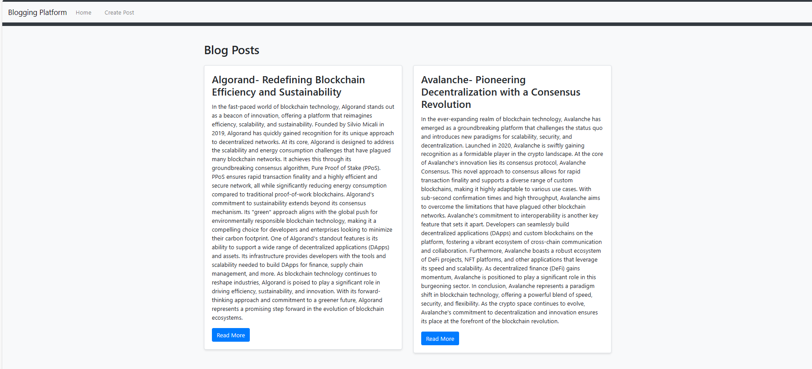

# Basic Blogging Platform

Basic Blogging Platform is a simple web application built using Python and Flask that allows users to write and publish blog posts with titles and content.

## Features

- Create and publish blog posts.
- View a list of all published blog posts.
- Bootstrap for improved visual design.
- Text files used to store blog posts.

## Project Structure

- `blogging_platform/`: The main project directory.
    - `app.py`: The Flask application code.
    - `templates/`: HTML templates for the web pages.
        - `base.html`: Base template for all pages.
        - `home.html`: Page to view all published blog posts.
        - `post.html`: Page to view an individual blog post.
        - `create_post.html`: Page to create a new blog post.
    - `static/`: Static files like CSS.
        - `style.css`: Custom CSS for styling.
    - `posts/`: Directory to store blog posts as text files.
    - `venv/`: Virtual environment directory (not included in the repository).

## Usage

1. Run the Flask application by executing `app.py`.
2. Access the Blogging Platform in your web browser at `http://localhost:5000/`.
3. View all published blog posts on the homepage.
4. Click on a blog post to view its content.
5. Create a new blog post by clicking "Create Post" in the navigation.

## Dependencies

- Flask: A micro web framework for Python.
- Bootstrap (via CDN): A front-end framework for styling the web application.

## Contribution

Contributions to this project are welcome. Feel free to submit issues or pull requests.

## License

This project is open-source and available under the [MIT License](LICENSE).
